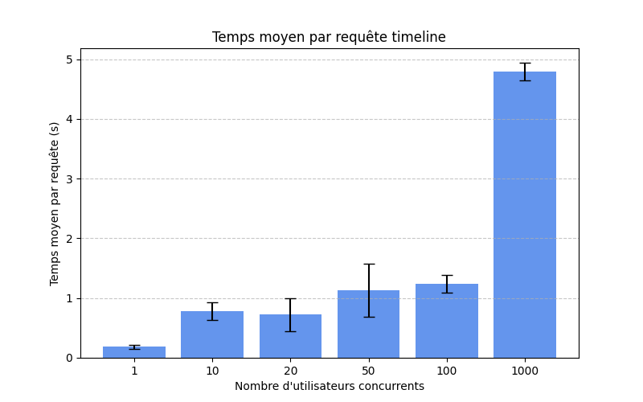
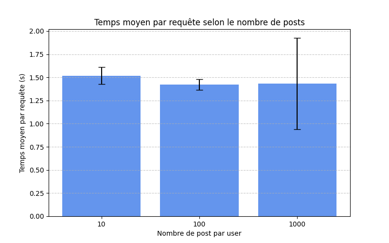

# Résultats des graphiques

## Temps moyen par requête selon le nombre d'utilisateurs concurrents

## Temps moyen par requête selon le nombre de posts

## Temps moyen par requête selon le nombre de followee
