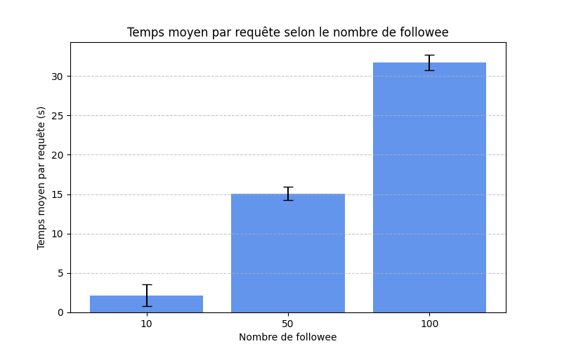

# Projet Data Massive - Résultats des graphiques

## Mesures avec Locust

Les mesures ont été réalisées avec l'outil Locust qui lance le fichier [benchmark.py](benchmark.py). Ce fichier décrit une classe montrant la tâche à réaliser pour chaque utilisateur fictif 
(qui doit donc accéder à sa timeline). Les seules modifications faites sur ce fichier au cours des tests concernent le nombre de user_id générés par le programme pour garantir le bon nombre
d'utilisateurs accédant à leur timeline en fonction des requêtes.
Les fichiers csv ayant permis de réaliser ces graphiques sont stockés dans le dossier `/out`.

## Temps moyen par requête selon le nombre d'utilisateurs concurrents

On peut constater ici que le temps d'attente augmente avec de plus en plus d'utilisateurs concurrents, ainsi qu'une variation de résultats beaucoup plus large.

## Temps moyen par requête selon le nombre de posts

Le temps moyen par requête ne semble pas être affecté par le nombre de posts, car il reste compris entre 0.4 secondes et 0.6 secondes que les utilisateurs aient 10, 100 ou 1000 posts.

## Temps moyen par requête selon le nombre de followee

Comme pour le premier graphe, le temps d'attente et les variations de résultats augmentent significativement avec le nombre de followee. Cependant, les ordres de grandeurs sont bien plus élevés ici, une requête pouvant durer jusqu'à plus de 17 secondes lorsque les utilisateurs suivent 100 personnes.